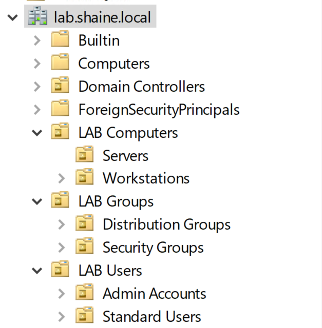
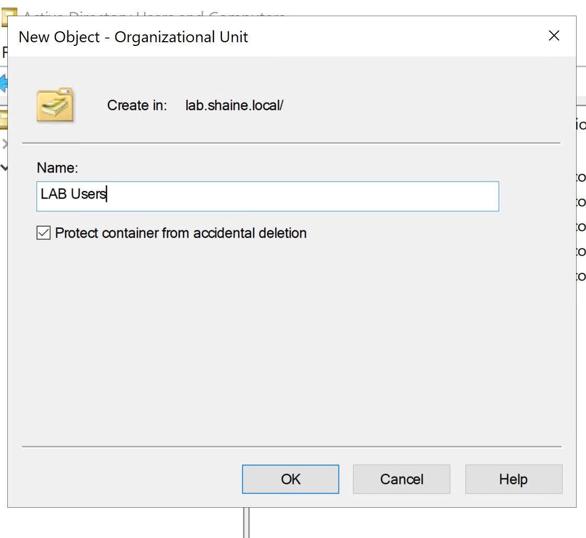
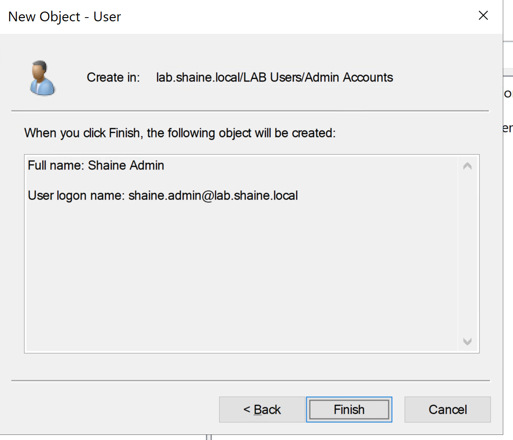
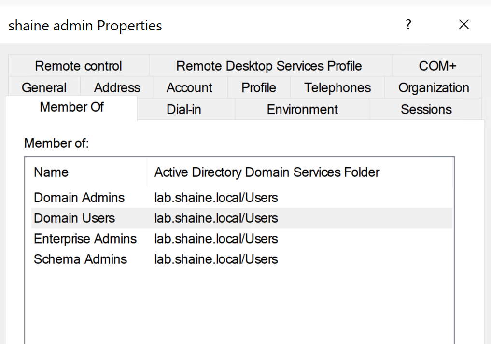
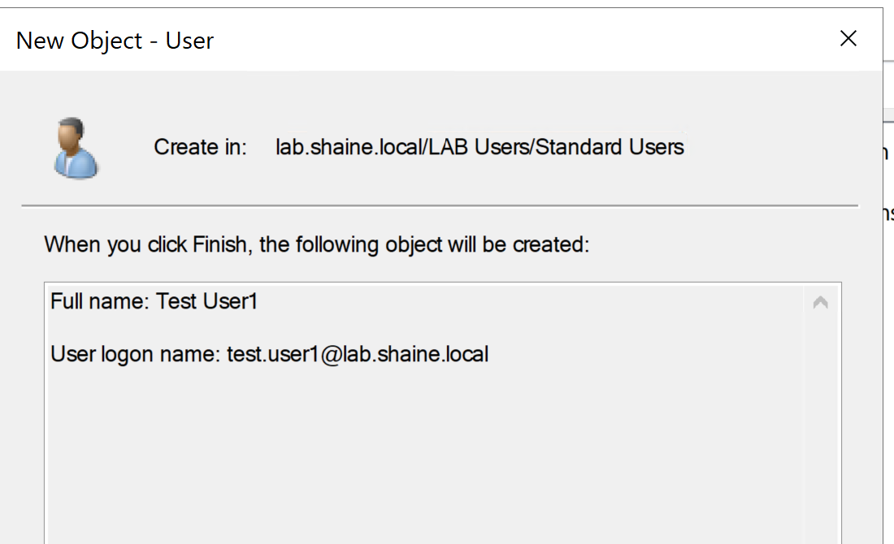
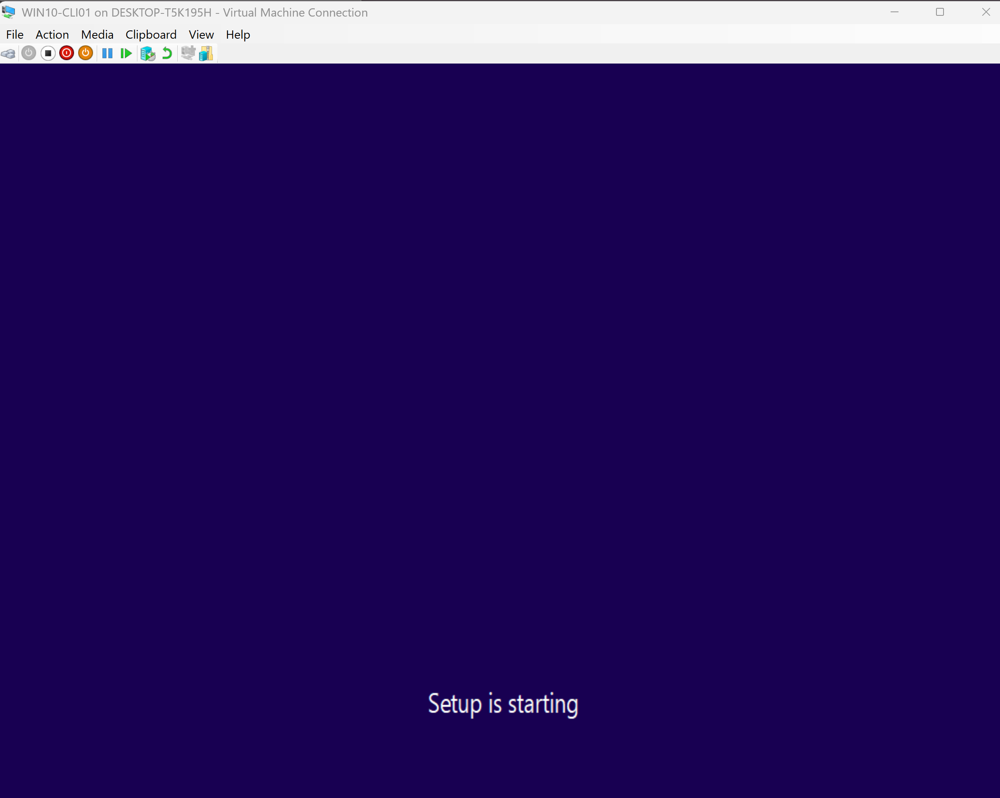
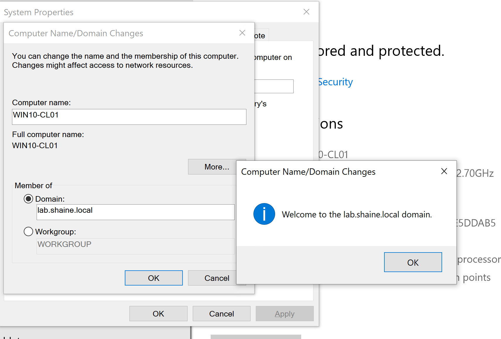

# homelab-portfolio
# 🖥️ Windows Server & Active Directory Homelab Portfolio  
**Built by Shaine**  
Role Focus: System Administrator / M365 Admin / Infrastructure Engineer

---

## 📌 Overview  
This repository documents my complete hands-on homelab project where I built a functional Windows Server Active Directory environment using Hyper-V.  
The goal is to demonstrate my practical skills in identity, networking, automation, and system administration.

This lab includes:

- Hyper-V VM Creation (DC01)
- Windows Server 2022 Domain Controller  
- DNS, DHCP, Group Policy  
- File Server with NTFS and share permissions  
- Windows 10 workstation joined to the domain  
- PowerShell automation scripts  
- Clean, enterprise-style OU structure  
- Documentation and screenshots of every major task

---

## 🗺️ Lab Architecture  
**Hypervisor:** Hyper-V  
**Network:** Internal switch (LAB-SWITCH)  
**Domain:** `lab.shaine.local`  
**Static IP:** 10.0.0.10 (DC01)

```
┌─────────────────────┐
│ Hyper-V │
│ Internal Switch │
└──────────┬──────────┘
│
┌──────────┴──────────┐
│ DC01 │
│ Windows Server 2022 │
│ AD DS, DNS, DHCP │
└──────────┬──────────┘
│
┌──────────┴──────────┐
│ SRV02 │
│ File Server / GPO │
└──────────┬──────────┘
│
┌──────────┴──────────┐
│ WIN10-CLI01 │
│ Workstation │
└─────────────────────┘
```

## 📁 Sections

0. Hyper-V VM Creation (DC01)
1. Domain Controller Deployment
2. Organizational Unit Structure
3. User & Group Management
4. Group Policies
5. DHCP Configuration
6. File Server (SRV02)
7. Windows 10 Domain Join
8. PowerShell Automation

---

### **0. Hyper-V VM Creation (DC01)**
This section shows the process of creating the first virtual machine in Hyper-V, which becomes the Domain Controller for lab.shaine.local.

✔ Tasks Performed
- Created a new virtual machine (DC01)
- Created a new Internal switch (LAB-SWITCH)
- Assigned it to an isolated internal network (LAB-SWITCH)
- Configured virtual hardware (memory, CPU, VHDX)
- Mounted Windows Server 2022 ISO
- Prepared DC01 for OS installation

### 📸 Screenshots  
#### Hyper-V Manager


#### Internal Switch Creation (LAB-SWITCH)


#### VM Name & Location


#### Generation 2 Selection


#### Memory Allocation


#### LAB-SWITCH Networking


#### VHDX Setup


#### ISO Installation Source


#### VM Summary Before Creation


#### Windows Server Setup Boot Screen


---

### **1. Domain Controller Deployment (DC01)**
This section covers the installation and configuration of the Domain Controller for the lab.shaine.local domain.
It includes static IP setup, AD DS + DNS installation, domain creation, and verification of SYSVOL and DNS health.

✔ Tasks Performed
- Installed Windows Server 2022
- Assigned static IP (10.0.0.10)
- Installed AD DS and DNS roles
- Promoted server to new forest: lab.shaine.local
- Verified DNS records and SYSVOL replication

### 📸 Screenshots
- **Server Manager – DC01 Overview**  
  

- **Static IPv4 Configuration**  
  

- **AD DS + DNS Roles Installed**  
  

- **Active Directory Users and Computers – Domain View**  
  

- **DNS Forward Lookup Zone – lab.shaine.local**  
  

- **SYSVOL Folder Verification**  
  


---

### **2. OU Unit Structure**
This section documents the creation of a clean, professional Active Directory OU layout used to separate users, computers, groups, and administrative accounts.
A well-designed OU structure is the foundation for scalable Group Policy management and enterprise-ready domain organization.

✔ Tasks Performed
- Created top-level OUs for Users, Computers, and Groups
- Added sub-OUs for Admin Accounts, Standard Users, Servers, and Workstations
- Adopted an enterprise-style naming standard for clear management
- Prepared the structure for Group Policy, user provisioning, and workstation domain joins

```
lab.shaine.local
│
├── LAB Users
│     ├── Admin Accounts
│     └── Standard Users
│
├── LAB Computers
│     ├── Servers
│     └── Workstations
│
└── LAB Groups
      ├── Security Groups
      └── Distribution Groups
```

### 📸 Screenshots
- **OU Structure (Full AD Tree Expanded)**  
  

- **New OU Creation Window**  
  

---

### **3. User & Group Management**
This section documents the creation of administrative and standard user accounts within the new Active Directory domain.
A separate admin account ensures best security practices, while a standard user account allows testing of Group Policy, permissions, and workstation domain joins.

✔ Tasks Performed
- Created a privileged admin account (shaine.admin)
- Added shaine.admin to:
- Domain Admins
- Enterprise Admins
- Schema Admins (lab-only)
- Created a standard user (test.user1)
- Placed accounts into proper Organizational Units
- Followed enterprise identity management practices

### 📸 Screenshots

- **Admin Account Creation (shaine.admin)**  
  

- **Admin Account – Group Memberships**  
  

- **Standard User Account Creation (test.user1)**  
  

---

### **4. Group Policies**
This section documents the creation and configuration of essential Group Policies used to manage users and computers across the lab.shaine.local domain.
These policies demonstrate core sysadmin skills in security hardening, user environment control, and centralized settings enforcement.

✔ Tasks Performed
- Created a Password Policy via Default Domain Policy
- Configured a Login Banner for legal/security compliance
- Applied a Custom Desktop Wallpaper using a GPO
- Deployed Drive Mapping using Group Policy Preferences
- Applied Control Panel Restrictions for standard users
- Verified GPO application using gpresult and RSOP


---

### **5. DHCP Configuration**
- Scope creation  
- Reservations  
- Lease testing  

Screenshots → `/screenshots/dhcp/`

---

### **6. File Server (SRV02)**
- Shared folders  
- NTFS vs share permissions  
- Access-based enumeration  
- Mapped drives via GPO  

Screenshots → `/screenshots/srv02/`

---

### **7. Windows 10 Domain Join**

This section documents the deployment and configuration of the Windows 10 client machine (WIN10-CLI01) and its successful integration into the Active Directory domain `lab.shaine.local`.  
A domain-joined workstation is essential for testing Group Policies, user authentication, drive mappings, NTFS permissions, and end-to-end sysadmin administration workflows.

✔ **Tasks Performed**
- Created and configured a new Windows 10 virtual machine (WIN10-CLI01)
- Renamed the PC following standard naming conventions
- Assigned a static IP for better lab control
- Joined the workstation to the domain `lab.shaine.local`
- Verified domain authentication using domain credentials
- Prepared the workstation for GPO, login scripts, and permission testing

---

### 📸 Screenshots  

- **WIN10-CLI01 – VM Summary in Hyper-V**  
  

- **Windows 10 Installation Complete**  
  

- **PC Renamed to WIN10-CLI01**  
  

- **Static IPv4 Configuration (WIN10-CLI01)**  
  

- **Domain Join Confirmation (lab.shaine.local)**  
  

---

### **8. PowerShell Automation Scripts**
Located in `/scripts/powershell/`

Includes:
- Bulk user creation  
- Exporting locked-out accounts  
- Password reset automations  
- AD reporting scripts  

---

## 🧠 Summary
This homelab demonstrates my hands-on ability to deploy and manage a complete Active Directory environment. It showcases my skills in:

- Identity & Access  
- Windows Server  
- Networking  
- Group Policy  
- File Server management  
- Troubleshooting  
- PowerShell automation  

This portfolio is actively updated as I progress in my System Administrator journey.
