# homelab-portfolio
# 🖥️ Windows Server & Active Directory Homelab Portfolio  
**Built by Shaine**  
Role Focus: System Administrator / M365 Admin / Infrastructure Engineer

---

## 📌 Overview  
This repository documents my complete hands-on homelab project where I built a functional Windows Server Active Directory environment using Hyper-V.  
The goal is to demonstrate my practical skills in identity, networking, automation, and system administration.

This lab includes:

- Hyper-V VM Creation (DC01)
- Windows Server 2022 Domain Controller  
- DNS, DHCP, Group Policy  
- File Server with NTFS and share permissions  
- Windows 10 workstation joined to the domain  
- PowerShell automation scripts  
- Clean, enterprise-style OU structure  
- Documentation and screenshots of every major task

---

## 🗺️ Lab Architecture  
**Hypervisor:** Hyper-V  
**Network:** Internal switch (LAB-SWITCH)  
**Domain:** `lab.shaine.local`  
**Static IP:** 10.0.0.10 (DC01)

```
┌─────────────────────┐
│ Hyper-V │
│ Internal Switch │
└──────────┬──────────┘
│
┌──────────┴──────────┐
│ DC01 │
│ Windows Server 2022 │
│ AD DS, DNS, DHCP │
└──────────┬──────────┘
│
┌──────────┴──────────┐
│ SRV02 │
│ File Server / GPO │
└──────────┬──────────┘
│
┌──────────┴──────────┐
│ WIN10-CLI01 │
│ Workstation │
└─────────────────────┘
```

## 📁 Sections

0. Hyper-V VM Creation (DC01)
1. Domain Controller Deployment
2. Organizational Unit Structure
3. User & Group Management
4. Group Policies
5. DHCP Configuration
6. File Server (SRV02)
7. Windows 10 Domain Join
8. PowerShell Automation

---

### **0. Hyper-V VM Creation (DC01)**
This section shows the process of creating the first virtual machine in Hyper-V, which becomes the Domain Controller for lab.shaine.local.

✔ Tasks Performed
- Created a new virtual machine (DC01)
- Created a new Internal switch (LAB-SWITCH)
- Assigned it to an isolated internal network (LAB-SWITCH)
- Configured virtual hardware (memory, CPU, VHDX)
- Mounted Windows Server 2022 ISO
- Prepared DC01 for OS installation

### 📸 Screenshots  
- Hyper-V Manager
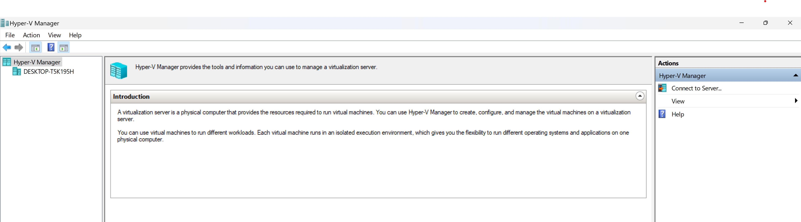

- Internal Switch Creation (LAB-SWITCH)
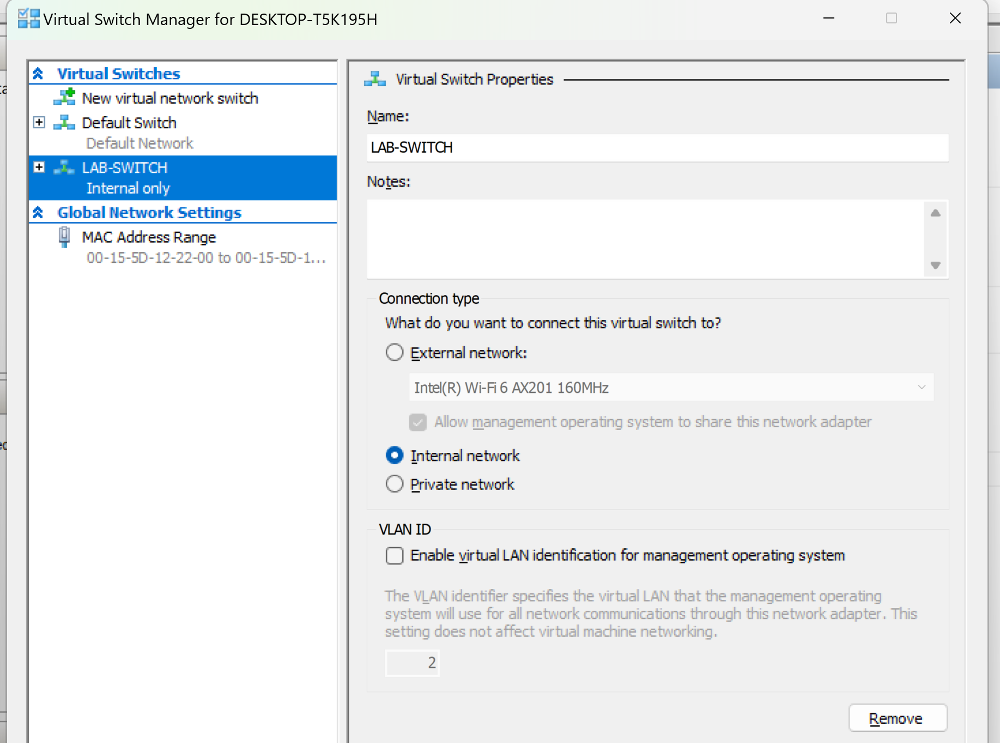

- VM Name & Location
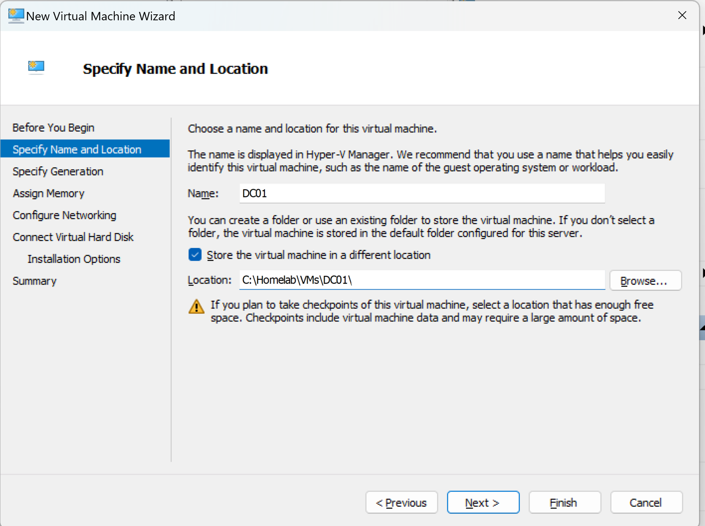

 - Generation 2 Selection
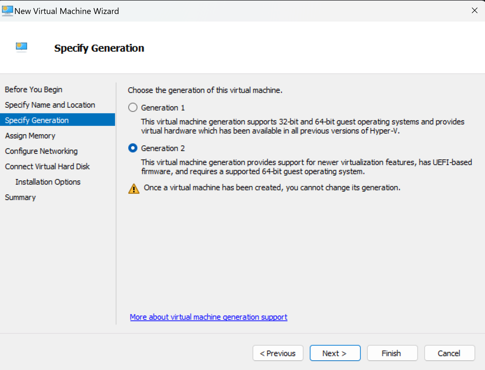

- Memory Allocation
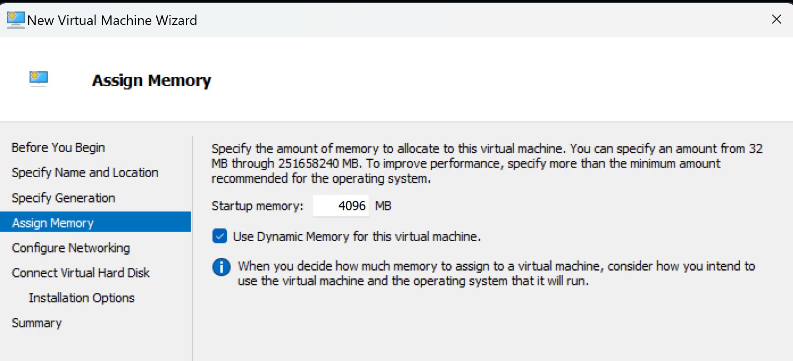

- LAB-SWITCH Networking
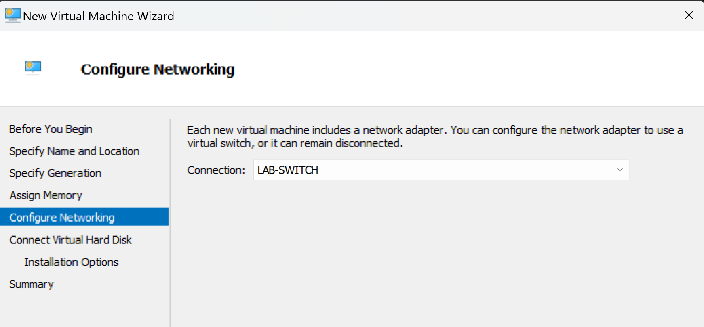

- VHDX Setup
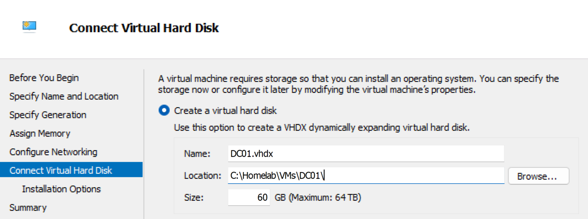

- ISO Installation Source
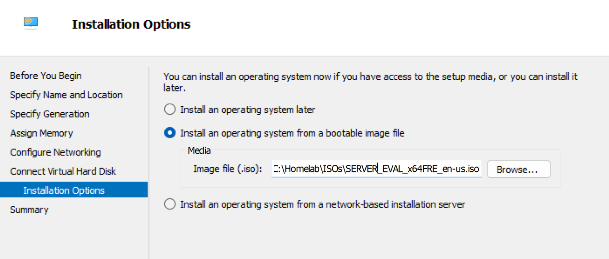

- VM Summary Before Creation
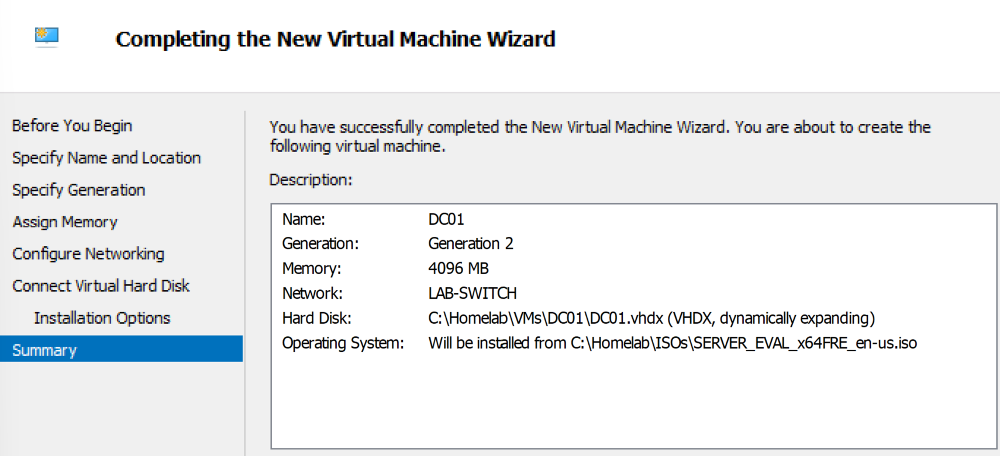

- Windows Server Setup Boot Screen
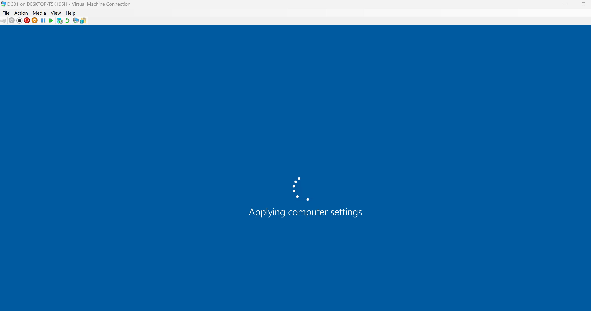

---

### **1. Domain Controller Deployment (DC01)**
This section covers the installation and configuration of the Domain Controller for the lab.shaine.local domain.
It includes static IP setup, AD DS + DNS installation, domain creation, and verification of SYSVOL and DNS health.

✔ Tasks Performed
- Installed Windows Server 2022
- Assigned static IP (10.0.0.10)
- Installed AD DS and DNS roles
- Promoted server to new forest: lab.shaine.local
- Verified DNS records and SYSVOL replication

### 📸 Screenshots 
#### Server Manager – DC01 Overview
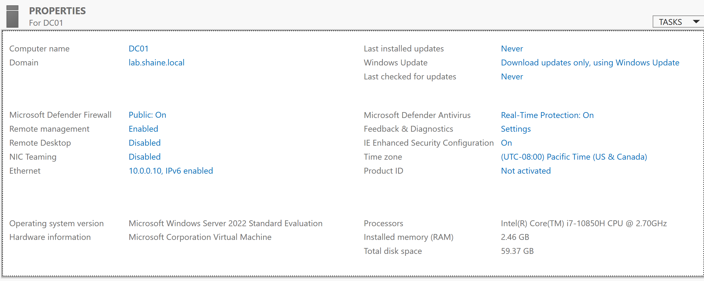

#### Static IPv4 Configuration
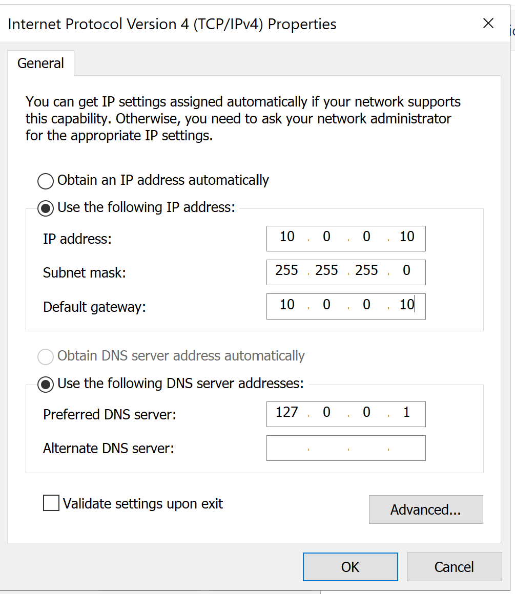

#### AD DS + DNS Installed
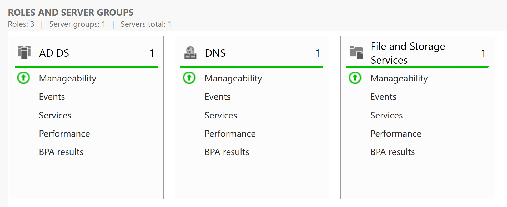

#### ADUC – Domain View
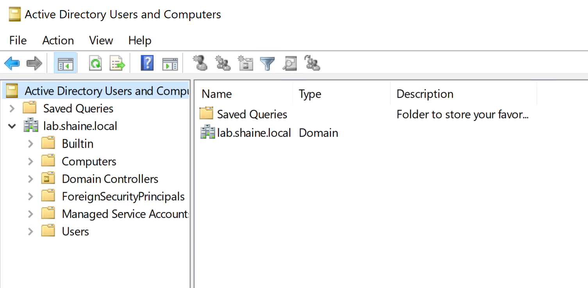

#### DNS Forward Lookup Zone
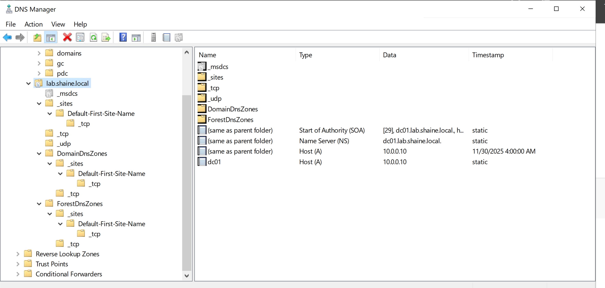

#### SYSVOL Verification
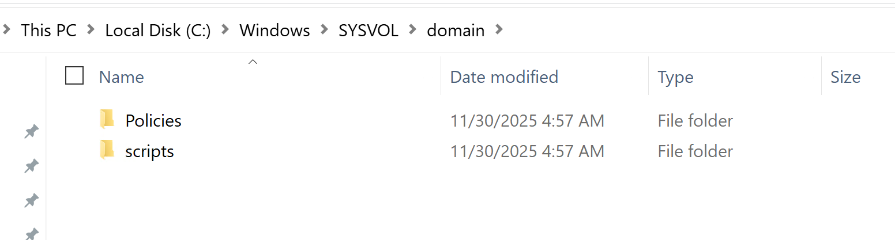

---

### **2. OU Structure**
Clean enterprise-style OU layout:

LAB Users
Admin Accounts
Standard Users
LAB Computers
Servers
Workstations
LAB Groups
Security Groups
Distribution Groups


Screenshots → `/screenshots/ad/`

---

### **3. User & Group Management**
- Admin account creation  
- Standard user accounts  
- Security group creation  

Screenshots → `/screenshots/ad/`

---

### **4. Group Policies**
Policies created:
- Password policies  
- Login banner  
- Drive mapping  
- Control Panel restrictions  
- Wallpaper policy  

Screenshots → `/screenshots/gpo/`

---

### **5. DHCP Configuration**
- Scope creation  
- Reservations  
- Lease testing  

Screenshots → `/screenshots/dhcp/`

---

### **6. File Server (SRV02)**
- Shared folders  
- NTFS vs share permissions  
- Access-based enumeration  
- Mapped drives via GPO  

Screenshots → `/screenshots/srv02/`

---

### **7. Windows 10 Domain Join**
- Domain join process  
- User logon tests  

Screenshots → `/screenshots/win10/`

---

### **8. PowerShell Automation Scripts**
Located in `/scripts/powershell/`

Includes:
- Bulk user creation  
- Exporting locked-out accounts  
- Password reset automations  
- AD reporting scripts  

---

## 🧠 Summary
This homelab demonstrates my hands-on ability to deploy and manage a complete Active Directory environment. It showcases my skills in:

- Identity & Access  
- Windows Server  
- Networking  
- Group Policy  
- File Server management  
- Troubleshooting  
- PowerShell automation  

This portfolio is actively updated as I progress in my System Administrator journey.
